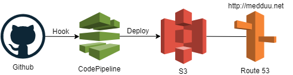

# Portfolio
포트폴리오를 S3로 자동 배포하여 웹 호스팅하기

	1. S3설정
	2. Route 53설정
	3. CodePipeline 생성

Portfolio : [http://medduu.net](http://medduu.net)

## 1. S3설정
### 1-1. S3 Bucket 생성
만드려는 도메인이름 그대로 bucket 생성. ex) medduu.net
### 1-2. S3 Bucket 설정 변경
1. [속성]-[정적 웹 사이트 호스팅] 에서 '이 버킷을 사용하여 웹 사이트를 호스팅 합니다.' 체크
2. [권한]-[퍼블릭엑세스 차단] 전부 차단 해제
3. [권한]-[버킷정책]
	>{  
    	"Version": "2012-10-17",  
		"Id": "Policy1561625995994",  
		"Statement": [  
			{  
				"Sid": "Stmt1561625991674",  
				"Effect": "Allow",  
				"Principal": "*",  
				"Action": "s3:GetObject",  
				"Resource": "arn:aws:s3:::medduu.net/*"  
			}  
		]  
	>}
### 1-3. S3 Bucket redirect 설정
>http://www.medduu.net 으로 접속하면 http://medduu.net 으로 Redirect

1. Redirect 하려는 도메인 이름 그대로 bucket 생성. ex) www.medduu.net
2. [속성]-[정적 웹 사이트 호스팅] 에서 요청 리디렉션 체크
3. 리디렉션 하려는 도메인 이름 입력 후 저장 ex) medduu.net
4. 2-2 에서 [레코드 설정] 에서 서브도메인 www 넣어서 하나 더 추가

## 2. Route 53설정
### 2.1. 도메인 구매
[등록된 도메인]-[도메인등록]
### 2.2. 레코드 설정
1. [호스팅 영역]-도메인 이름 체크-[레코드 세트로 이동]
2. [레코드 세트 생성]
	- 유형 : A
	- 별칭 : 예
	- 별칭대상 : 도메인 이름의 S3 Bucket 선택
	
## 3. CodePipeline 생성
- [CodePipeline]-[파이프라인]-[파이프라인 생성]
	+ Step 1) 이름입력 - 새 서비스 역할 - [다음]
	+ Step 2) 소스공급자 : [Github] - [GitHub에 연결] - [Github 웹 후크] - [다음]
	+ Step 3) 정적 웹 호스팅이기 때문에 [건너뛰기]
	+ Step 4) 배포공급자 : [Amazon S3] - [버킷 : 도메인이름의 버킷] - [객체 키: /] - [다음]